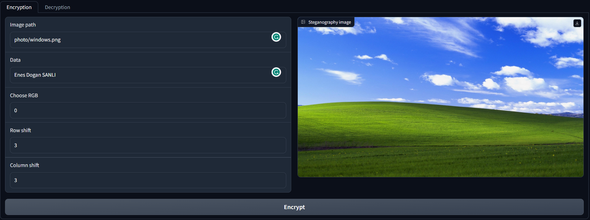
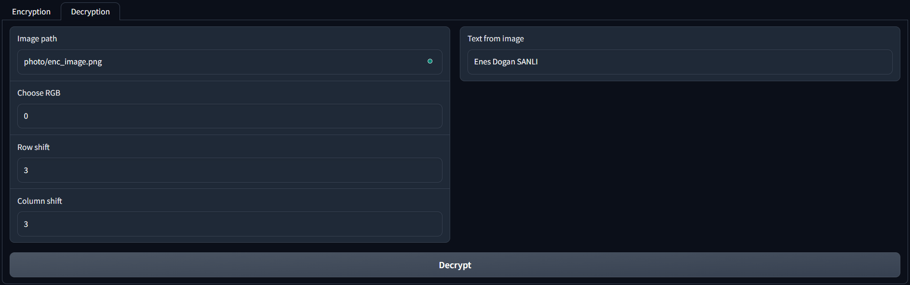

# Image Steganography

|Ad-Soyad|Öğrenci Numarası|
|-|-|
|Enes Doğan ŞANLI|21501081|

Bu proje kapsamında image steganography üzerine çalışılmıştır. Temel olarak LSB metotu kullanılmıştır. Lakin bu uygulamada sıralı bir veri gizleme işlemi yerine çok daha karmaşık ve kullanıcıya alternatif sunan bir yapı geliştirilmiştir. Kullanıcı seçmiş olduğu RGB değeri ile verinin hangi renk gamasına saklanabileceğini seçmektedir. Aynı zaman girilen Row Shift ve Column Shift değerlerine göre veri gizleme sırası kaydırmalı bir yapı haline getirilmiştir. İçerisine veri gizlenmiş resim üzerinden gizlenmiş veriyi okumakta mümkündür. Ama bunun için Choose RGB, Row Shift ve Column Shift değerlerinin bilinmesi gerekmektedir. Bu hali ile uygulama Caesar Cipher uygulamasına benzer bir mantıkta çalışmaktadır.

## Contents
- [Image Steganography](#image-steganography)
  - [Contents](#contents)
  - [Requirements](#requirements)
  - [Variables](#variables)
  - [Graphical User Interface (GUI)](#graphical-user-interface-gui)
    - [Encryption](#encryption)
      - [Inputs](#inputs)
      - [Outputs](#outputs)
    - [Decryption](#decryption)
      - [Inputs](#inputs-1)
      - [Outputs](#outputs-1)
  - [Constraints](#constraints)
  - [Future Work](#future-work)
  - [Conclusion](#conclusion)
  - [References](#references)

## Requirements

```
pip install -r requirements.txt
```

## Variables

|Variables | Explanation|
|-|-|
| Image Path Encryption | Steganography uygulamasında kullanılacak olan resim dosyasının konum bilgisi|
| Data | Resim içerisine gizlenecek bilgi |
| Choose RGB | Bilginin saklanacağı renk gaması (0 : Red, 1: Green, 2: Blue)|
| Row Shift | Satır kaydırma miktarı|
| Column Shift | Sütun kaydırma miktarı|
| Image Path Decryption | Steganalysis uygulamasında kullanılacak olan resim dosyasının konum bilgisi|

## Graphical User Interface (GUI)

GUI yapısal olarak 2 ana bölümden oluşmaktadır. Bu bölümler Encryption ve Decryption olarak adlandırılmıştır.

### Encryption

Bu bölümde sisteme girdi olarak Image Path Encryption, Data, Choose RGB, Row Shift, Column Shift bilgileri istenir ve steganography  işlemi gerçekleştirilir. Bu işlem sonucunda içerisine veri gizlenmiş olan görsel kullanıcıya döndürülür.

#### Inputs
* Image Path Encryption 
* Data
* Choose RGB (0 : Red, 1: Green, 2: Blue)
* Row Shift (int)
* Column Shift (int)

#### Outputs

* Image
  


### Decryption

Bu bölümde sisteme girdi olarak Image Path Decryption, Choose RGB, Row Shift, Column Shift bilgileri istenir ve steganalysis işlemi gerçekleştirilir. İşlem sonucunda resim içerisine gizlenmiş metin bilgisi kullanıcıya döndürülür.

#### Inputs
* Image Path Encryption 
* Choose RGB (0 : Red, 1: Green, 2: Blue)
* Row Shift (int)
* Column Shift (int)

#### Outputs

* Text (Decrypted)



## Constraints

* Seçilen shift değerlerine göre gizlenebilen mesaj boyutu kısalmaktadır.
* Türkçe karekterler desteklenmemektedir.
* Veri gizlemede kullanılacak olan resim formatı PNG olmalıdır.

## Future Work

* Veri gizleme başlangıç noktası rastgele seçilebilir.
* Seçilen shift değerinden kaynaklı mesaj boyutu kısıtlaması optimize edilebilir.

## Conclusion

Bu çalışma kapsamında ileri düzeyde LSB (Least Significant Bit Insertion Methods) uygulaması geliştirilmeye çalışılmıştır. Temel LSB metot uygulamasında veriler sıralı bir şekilde resim içerisine gizlenirken bu uygulama kapsamında kullanıcının seçmiş olduğu değişken değerlerine göre bir veri gizleme işlemi gerçekleştirilmiştir. Kullanıcının girmiş olduğu Choose RGB, Row Shift ve Column Shift değerlerine göre veri resim içerisinde sıralı olmayacak şekilde gizlenebilmektedir. Girilen Row Shift ve Column Shift değerlerine göre gizlenebilecek veri boyutu azalmaktadır. Girilen değerlere göre gizlenebilecek veri boyutu hesaplanmakta ve gizlenmek istenen verinin boyutu ile karşılaştırılmaktadır. Boyut aşımı olması durumunda kullanıcıya uyarı verilmektedir.

## References

* https://www.geeksforgeeks.org/image-based-steganography-using-python/
* https://www.javatpoint.com/image-steganography-using-python
* https://towardsdatascience.com/hiding-data-in-an-image-image-steganography-using-python-e491b68b1372
* https://betterprogramming.pub/image-steganography-using-python-2250896e48b9